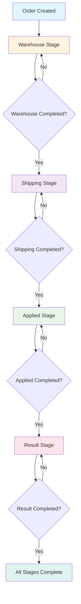
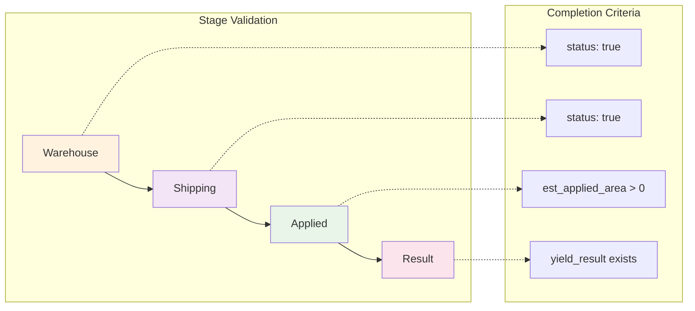
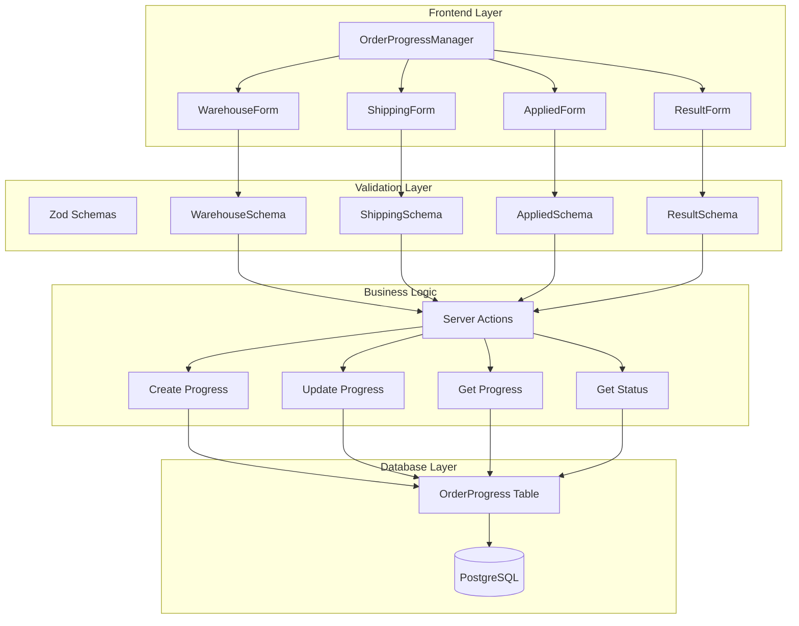

# Order Progress Management System

## Overview

Sistem Order Progress Management adalah fitur untuk melacak dan mengelola progres pesanan melalui 4 tahapan berurutan. Sistem ini mengimplementasikan validasi urutan tahapan dimana pengguna harus menyelesaikan tahapan sebelumnya untuk dapat melanjutkan ke tahapan berikutnya.

## Tahapan Progres

### 1. Warehouse (Gudang)
- **Tujuan**: Input data gudang dan status kesiapan
- **Data**: 
  - `status`: boolean - Status apakah warehouse sudah siap
- **Kondisi Completed**: `data.status === true`

### 2. Shipping (Pengiriman)
- **Tujuan**: Input data pengiriman dan status
- **Data**:
  - `status`: boolean - Status pengiriman
- **Kondisi Completed**: `data.status === true`
- **Prerequisite**: Warehouse harus completed

### 3. Applied (Aplikasi)
- **Tujuan**: Input estimasi area aplikasi
- **Data**:
  - `est_applied_area`: number - Estimasi area yang diaplikasikan
- **Kondisi Completed**: `data.est_applied_area > 0`
- **Prerequisite**: Warehouse dan Shipping harus completed

### 4. Result (Hasil)
- **Tujuan**: Input hasil yield
- **Data**:
  - `yield_result`: any - Hasil yield
- **Kondisi Completed**: `data.yield_result` exists
- **Prerequisite**: Warehouse, Shipping, dan Applied harus completed

## Alur Kerja (Workflow)

### Diagram Alur Utama



### Diagram Validasi Sequential



### Diagram Arsitektur Sistem



## Struktur Database

### Table: order_progress

```sql
CREATE TABLE order_progress (
  id VARCHAR(191) PRIMARY KEY,
  order_id VARCHAR(191) NOT NULL,
  stage ENUM('warehouse', 'shipping', 'applied', 'result') NOT NULL,
  data JSON NOT NULL,
  createdAt DATETIME(3) NOT NULL DEFAULT CURRENT_TIMESTAMP(3),
  updatedAt DATETIME(3)
);
```

### Indexes
- `order_id` - untuk query berdasarkan pesanan
- `(order_id, stage)` - untuk query progres spesifik tahapan

## Arsitektur Sistem

### 1. Database Layer
- **File**: `prisma/schema.prisma`
- **Model**: `OrderProgress`
- **Fungsi**: Menyimpan data progres pesanan

### 2. Schema Validation
- **File**: `schema/order-progress/index.ts`
- **Library**: Zod
- **Fungsi**: Validasi input data untuk setiap tahapan

### 3. Server Actions
- **File**: `actions/order-progress/index.ts`
- **Fungsi**: CRUD operations untuk progres pesanan
- **Functions**:
  - `createOrderProgress()` - Membuat progres baru
  - `updateOrderProgress()` - Update progres existing
  - `getOrderProgressByOrderId()` - Ambil semua progres pesanan
  - `getStageProgress()` - Ambil progres tahapan tertentu
  - `deleteOrderProgress()` - Hapus progres
  - `getProgressStagesStatus()` - Ambil status semua tahapan

### 4. UI Components
- **Main Manager**: `components/order-progress/OrderProgressManager.tsx`
- **Form Components**:
  - `WarehouseProgressForm.tsx`
  - `ShippingProgressForm.tsx`
  - `AppliedProgressForm.tsx`
  - `ResultProgressForm.tsx`

### 5. Admin Pages
- **List Page**: `app/admin/order-progress/page.tsx`
- **Data Table**: `app/admin/order-progress/data-table.tsx`
- **Columns**: `app/admin/order-progress/columns.tsx`

## Dependencies

### Core Dependencies

| Package | Version | Purpose | Documentation |
|---------|---------|---------|---------------|
| `@prisma/client` | `^5.x.x` | Database ORM client | [Prisma Docs](https://www.prisma.io/docs) |
| `prisma` | `^5.x.x` | Database toolkit | [Prisma CLI](https://www.prisma.io/docs/reference/api-reference/command-reference) |
| `zod` | `^3.x.x` | Schema validation | [Zod Docs](https://zod.dev) |
| `react-hook-form` | `^7.x.x` | Form state management | [React Hook Form](https://react-hook-form.com) |
| `@hookform/resolvers` | `^3.x.x` | Form validation resolvers | [Resolvers](https://github.com/react-hook-form/resolvers) |

### UI Dependencies

| Package | Version | Purpose | Documentation |
|---------|---------|---------|---------------|
| `lucide-react` | `^0.x.x` | Icon library | [Lucide Icons](https://lucide.dev) |
| `sonner` | `^1.x.x` | Toast notifications | [Sonner](https://sonner.emilkowal.ski) |
| `@radix-ui/react-checkbox` | `^1.x.x` | Checkbox component | [Radix Checkbox](https://www.radix-ui.com/docs/primitives/components/checkbox) |
| `@radix-ui/react-select` | `^2.x.x` | Select component | [Radix Select](https://www.radix-ui.com/docs/primitives/components/select) |
| `@radix-ui/react-form` | `^0.x.x` | Form components | [Radix Form](https://www.radix-ui.com/docs/primitives/components/form) |
| `date-fns` | `^2.x.x` | Date formatting | [Date-fns](https://date-fns.org) |

### Development Dependencies

| Package | Version | Purpose | Documentation |
|---------|---------|---------|---------------|
| `typescript` | `^5.x.x` | Type checking | [TypeScript](https://www.typescriptlang.org) |
| `@types/node` | `^20.x.x` | Node.js type definitions | [DefinitelyTyped](https://github.com/DefinitelyTyped/DefinitelyTyped) |
| `eslint` | `^8.x.x` | Code linting | [ESLint](https://eslint.org) |
| `prettier` | `^3.x.x` | Code formatting | [Prettier](https://prettier.io) |
| `tailwindcss` | `^3.x.x` | CSS framework | [Tailwind CSS](https://tailwindcss.com) |

### Installation Commands

```bash
# Install core dependencies
npm install @prisma/client prisma zod react-hook-form @hookform/resolvers

# Install UI dependencies
npm install lucide-react sonner @radix-ui/react-checkbox @radix-ui/react-select @radix-ui/react-form date-fns

# Install development dependencies
npm install -D typescript @types/node eslint prettier tailwindcss
```

## API Reference

### Server Actions

#### `createOrderProgress(data: AnyProgress)`
Membuat progres pesanan baru untuk tahapan tertentu.

**Parameters:**
- `data`: Object progres sesuai dengan schema tahapan

**Returns:**
- `Promise<{ success: boolean; data?: OrderProgress; error?: string }>`

**Example:**
```typescript
const result = await createOrderProgress({
  order_id: "order-123",
  stage: "warehouse",
  data: { status: true }
});
```

#### `updateOrderProgress(id: string, data: AnyProgress)`
Memperbarui progres pesanan yang sudah ada.

**Parameters:**
- `id`: ID record progres
- `data`: Object progres yang diperbarui

**Returns:**
- `Promise<{ success: boolean; data?: OrderProgress; error?: string }>`

#### `getOrderProgressByOrderId(orderId: string)`
Mengambil semua progres untuk pesanan tertentu.

**Parameters:**
- `orderId`: ID pesanan

**Returns:**
- `Promise<OrderProgress[]>`

#### `getStageProgress(orderId: string, stage: ProgressStage)`
Mengambil progres untuk tahapan tertentu.

**Parameters:**
- `orderId`: ID pesanan
- `stage`: Tahapan progres

**Returns:**
- `Promise<OrderProgress | null>`

#### `getProgressStagesStatus(orderId: string)`
Mengambil status completed untuk semua tahapan.

**Parameters:**
- `orderId`: ID pesanan

**Returns:**
- `Promise<StageStatus>`

### Component Props

#### `OrderProgressManagerProps`
```typescript
interface OrderProgressManagerProps {
  orderId: string;           // ID pesanan
  onProgressUpdate?: () => void;  // Callback saat progres diupdate
}
```

#### Form Component Props
```typescript
interface ProgressFormProps {
  orderId: string;           // ID pesanan
  existingData?: {           // Data existing (untuk edit)
    id: string;
    data: StageData;
  } | null;
  onSuccess?: () => void;    // Callback saat berhasil submit
}
```

## Cara Menjalankan Fitur

### 1. Setup Database
```bash
# Generate Prisma client
npx prisma generate

# Run database migrations
npx prisma db push
```

### 2. Development Server
```bash
# Start development server
npm run dev

# Access admin panel
http://localhost:3000/admin/order-progress
```

### 3. Penggunaan
1. Buka halaman admin order progress
2. Pilih pesanan yang akan dikelola progresnya
3. Mulai dari tahapan Warehouse
4. Isi data dan centang status jika sudah siap
5. Submit form untuk melanjutkan ke tahapan berikutnya
6. Ulangi untuk tahapan Shipping, Applied, dan Result

### 4. Integrasi dalam Kode

#### Menggunakan OrderProgressManager
```tsx
import { OrderProgressManager } from '@/components/order-progress/OrderProgressManager';

function OrderDetailPage({ orderId }: { orderId: string }) {
  return (
    <div>
      <h1>Order Details</h1>
      <OrderProgressManager 
        orderId={orderId}
        onProgressUpdate={() => {
          console.log('Progress updated');
          // Refresh data atau update UI
        }}
      />
    </div>
  );
}
```

#### Menggunakan Individual Forms
```tsx
import { WarehouseProgressForm } from '@/components/order-progress/WarehouseProgressForm';

function CustomWarehousePage({ orderId }: { orderId: string }) {
  return (
    <WarehouseProgressForm
      orderId={orderId}
      onSuccess={() => {
        // Handle success
        router.push('/next-stage');
      }}
    />
  );
}
```

#### Menggunakan Server Actions
```tsx
import { getProgressStagesStatus } from '@/actions/order-progress';

function useOrderProgress(orderId: string) {
  const [status, setStatus] = useState(null);
  
  useEffect(() => {
    async function fetchStatus() {
      const stageStatus = await getProgressStagesStatus(orderId);
      setStatus(stageStatus);
    }
    fetchStatus();
  }, [orderId]);
  
  return status;
}
```

## Validasi dan Error Handling

### Client-side Validation
- Menggunakan Zod schema untuk validasi form
- Real-time validation dengan react-hook-form
- Visual feedback untuk field yang error

### Server-side Validation
- Double validation di server actions
- Type-safe dengan TypeScript
- Proper error messages

### Sequential Validation
- Form tahapan berikutnya terkunci jika tahapan sebelumnya belum selesai
- Visual indicator dengan overlay "Complete previous stage first"
- Automatic unlock setelah tahapan sebelumnya completed

## Testing

### Unit Tests
```bash
# Run unit tests
npm run test

# Run tests with coverage
npm run test:coverage
```

### Integration Tests
```bash
# Test database operations
npm run test:db

# Test API endpoints
npm run test:api
```

### E2E Tests
```bash
# Run end-to-end tests
npm run test:e2e
```

## Performance Considerations

### Database Optimization
- Proper indexing pada `order_id` dan `(order_id, stage)`
- JSON field untuk flexible data structure
- Efficient queries dengan Prisma

### Frontend Optimization
- React.memo untuk prevent unnecessary re-renders
- Optimistic updates untuk better UX
- Lazy loading untuk large datasets

### Caching Strategy
- Next.js revalidatePath untuk cache invalidation
- Client-side caching dengan React Query (optional)

## Security

### Authentication
- Protected routes dengan middleware
- Role-based access control

### Data Validation
- Input sanitization
- SQL injection prevention dengan Prisma
- XSS protection

### Authorization
- User dapat hanya mengakses pesanan yang authorized
- Admin dapat mengakses semua pesanan

## Monitoring dan Logging

### Error Tracking
- Console.error untuk development
- Sentry integration untuk production (optional)

### Performance Monitoring
- Database query performance
- Component render performance
- API response times

## Troubleshooting

### Common Issues

1. **Form tidak dapat disubmit**
   - Cek validasi Zod schema
   - Pastikan semua required fields terisi
   - Cek network connection

2. **Tahapan tidak unlock**
   - Pastikan tahapan sebelumnya sudah completed
   - Refresh halaman untuk update status
   - Cek data di database

3. **Data tidak tersimpan**
   - Cek database connection
   - Pastikan Prisma schema up-to-date
   - Cek server logs untuk error

### Debug Mode
```bash
# Enable debug logging
DEBUG=prisma:* npm run dev

# Check database state
npx prisma studio
```

## Future Enhancements

### Planned Features
- [ ] Email notifications untuk setiap tahapan
- [ ] File upload untuk dokumentasi
- [ ] Bulk operations untuk multiple orders
- [ ] Export data ke Excel/PDF
- [ ] Real-time updates dengan WebSocket
- [ ] Mobile responsive design
- [ ] Audit trail untuk tracking changes

### Performance Improvements
- [ ] Database query optimization
- [ ] Frontend bundle size reduction
- [ ] CDN integration untuk static assets
- [ ] Service Worker untuk offline support

## Contributing

### Development Guidelines
1. Follow TypeScript strict mode
2. Use Prettier untuk code formatting
3. Write comprehensive tests
4. Update documentation untuk new features
5. Follow semantic versioning

### Code Review Checklist
- [ ] Type safety
- [ ] Error handling
- [ ] Performance impact
- [ ] Security considerations
- [ ] Documentation updates
- [ ] Test coverage

---

**Last Updated**: January 2024  
**Version**: 1.0.0  
**Maintainer**: Development Team